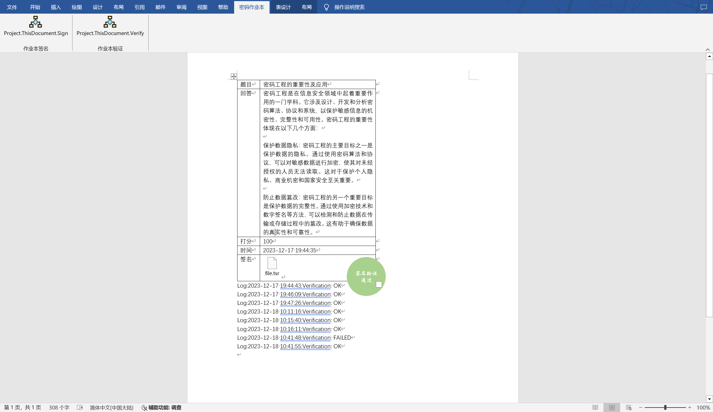
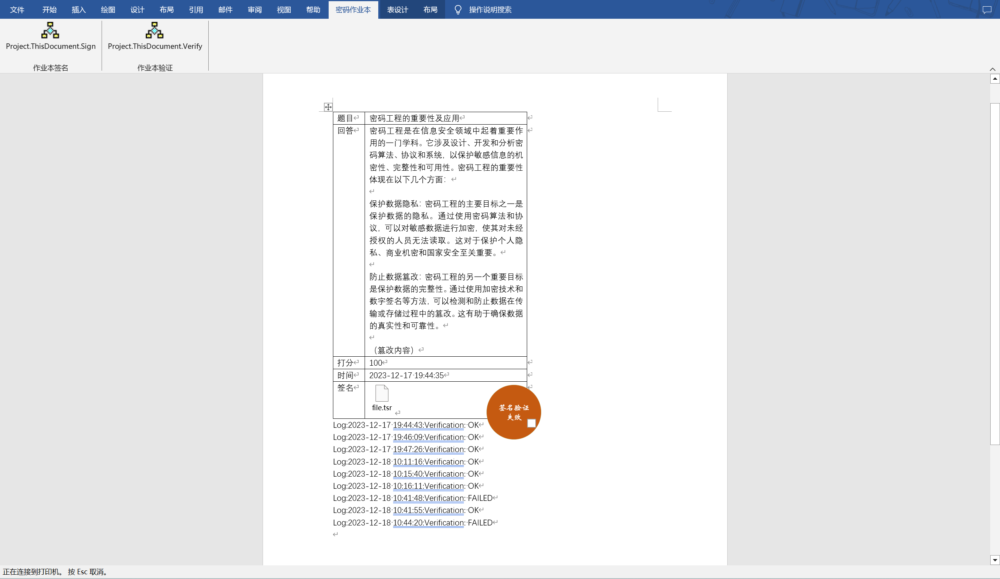

# Safety-exercise-book
安全作业本：带有tsa时间戳验证的安全作业本项目

## 项目介绍
此项目思路源于山东大学软件学院密码工程课程作业，项目针对学生线上学习时提交作业及老师打分的情景，开发了一款密码作业本，实现了老师对打分后的作业进行签名以及签名后验证的工作，有效地避免了老师打分后学生篡改答案并对打分分值提出质疑的情况发生。

    
    

此项目的核心算法为tsa签名算法，老师掌管私钥，使用私钥对学生回答进行签名后，使用公钥对签名文件进行验证。学生无法获得老师私钥，因此学生无法对篡改后的答案进行重新签名，只能对签名使用公钥进行验证。使用的tsa加密网站：<https://freetsa.org/index_zh.php>

## 项目使用
### 方法一：使用示例文档
1. 打开文档main.docm。文档中已经有一个示例。题目、回答、打分都可以修改。
2. 签名：修改后，删除当前的签名文件file.tsr，找到视图--宏，运行sign宏对当前回答进行签名。签名的同时程序会修改签名时间。
3. 验证：运行verify宏，实现对文档验证，程序会自动盖章，并将验证的log记录在下方。
4. 每次打开文档，若已经进行了签名，程序将自动验证签名并盖章。
5. 如果要发布作业，请将宏设置为private或者保存在本地，防止学生使用。

### 方法二：自行构建密码作业本
1. 创建一个.docm的文档，例如main.docm。
2. Alt+F11打开宏编辑文件，将document_copy.txt文件内容复制到Project(Main)/Microsoft Word对象/ThisDocument中。
3. 右键Project(Main)，点击插入--模块，添加模块1，将module1_copy.txt中内容复制到模块1中。
4. 在 Visual Basic 编辑器中，选择 "工具" 菜单，然后选择 "引用"。这将打开 "引用" 对话框。在 "引用" 对话框中，滚动并找到 "Microsoft Shell Controls And Automation"（可能显示为 "Shell32"）。勾选该选项。
5. 关闭docm文件，重新打开，脚本自动执行并创建作业表格，随后可以编辑题目、回答、打分等内容。
6. 当需要对回答进行签名时，点击视图--宏，运行sign宏对当前回答进行签名。签名的同时程序会修改签名时间。
7. 每次打开文档，若已经进行了签名，程序将自动验证签名并盖章。

## 项目运行原理
1. 打开文档后动作：首先打开文档后项目将检查文档内容：若是空文档，则创建题目表格；若文档题目/回答/打分/签名未完成，则发出提示完成相应动作；若文档已经完成所有内容并签名，则进行验证并加盖验证章。
2. 签名时动作：首先判断是否已经签名。如果已经签名则提示并退出；如果未签名，首先将签名时间记录到表格，随后依次执行：
    - 获取学生回答的MD5，并写到D:\file.txt中
    - 将MD5进行二次哈希，生成tsq请求文件
    - 对tsq请求文件进行密钥加密，生成tsr签名文件
    - 将tsr签名文件保存到文档中
    - 删除在D:\位置临时生成的file.txt、file.tsq、file.tsr文件
3. 验证时动作：
   - 首先按照相同的流程在D:\生成file.txt以及tsq文件
   - 下载tsa公钥以及签名公钥
   - 将单元格中的文件提取
     - 创建临时文件夹temp、target
     - 提取tsr文件到临时文件夹
     - 将tsr文件转存到D:\
     - 删除临时文件夹
    - 验证签名文件的有效性以及使用签名文件验证回答是否被篡改
    - 若验证通过，则将验证log记录，同时加盖验证通过章
    - 若验证未通过，同样记录log，并加盖验证未通过章
